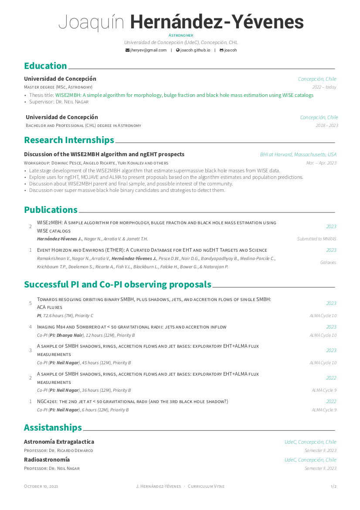

Resume / Curriculum Vitae (Academic)
==========================

[][download_aca]

[download_aca]: https://joacoh.github.io/files/cv.pdf

This repository store the academic curriculum vitae (CV) for Joaquín Hernández-Yévenes (Universidad de Concepción, Concepción, Chile 🇨🇱).

Credit
-------
The template design is based on:
  - [AwesomeCV](https://github.com/posquit0/Awesome-CV)
  - [Benoît Seignovert CV](https://github.com/seignovert/cv)

* [**LaTeX**](http://www.latex-project.org) is a fantastic typesetting program that a lot of people use these days, especially the math and computer science people in academia.
* [**LaTeX FontAwesome**](https://github.com/furl/latex-fontawesome) is bindings for FontAwesome icons to be used in XeLaTeX.
* [**Roboto**](https://github.com/google/roboto) is the default font on Android and ChromeOS, and the recommended font for Google’s visual language, Material Design.